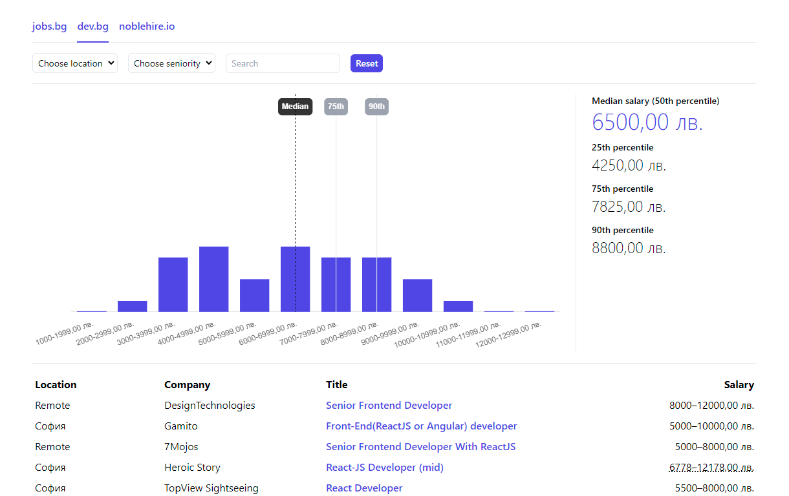

# Salaree

A salary analysis tool for software engineers working in Bulgaria.

## Why

When applying for jobs, sooner or later you are asked the dreaded salary expectation question. There are many ways to answer it, but at the very least you should know the current market trends and what companies are willing to pay for a given position.

Luckily, in the past few years a lot of companies have started to disclose salaries in their job postings. What was missing for me was a way to compile this data and get a reading on the market. I built Salaree for this purpose; it will scrape some of the biggest job boards and provide easy-to-read statistics and prepare you for your next interview.

## Features

- Supported job boards:
  - [jobs.bg](https://www.jobs.bg/)
  - [dev.bg](https://dev.bg/)
  - [noblehire.io](https://noblehire.io/)
- Automatic conversion of gross to net salaries
- Filters by location, seniority, company name, job title
- Statistics on median salaries, along with the 25/75/90th percentiles
- Data saved locally as JSON files

## Usage

⚠️ As the tool scrapes public websites, it is intentionally not hosted and is meant for personal use only.

To run it:

- Clone the repo
- Go to each scraper under `/pages/api/scrape` and set the `SCRAPE_URL` to the exact page you would like to scrape from (examples provided)
- `npm install`
- `npm run dev`

## Credits

Although the design is minimal and mostly using Tailwind CSS primitives, the stats and chart section is heavily inspired by the [levels.fyi](https://www.levels.fyi/) interface.
